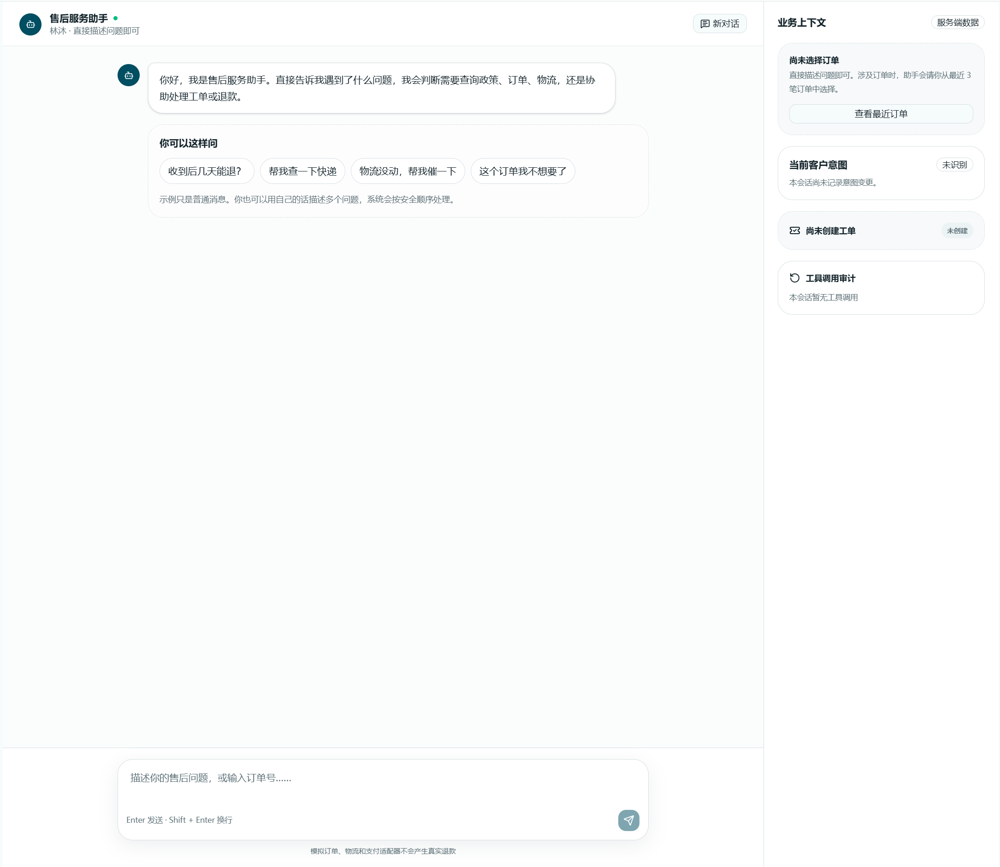
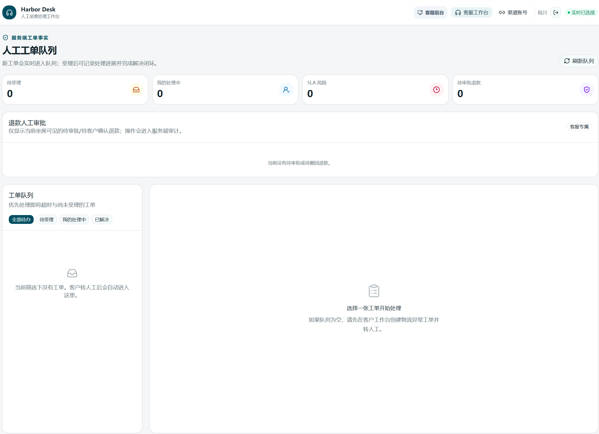
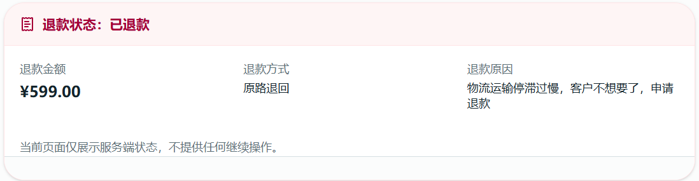
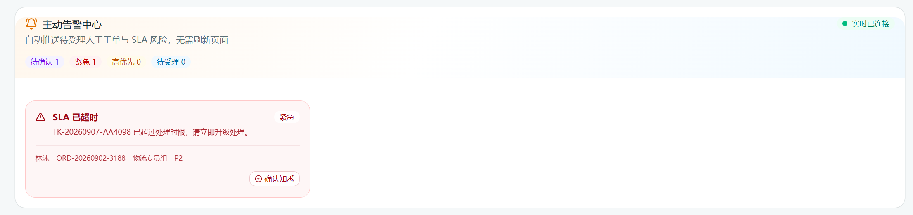

# Harbor Support

Harbor Support 是一个面向电商售后团队的客服工作台：让客户更快得到可解释的答复，让客服在需要人工判断的地方保留完整控制权。

当前版本适合本地产品演示和网页验收。它不声称已经接入闲鱼官方服务，也不会替用户登录、接收验证码、保存 Cookie/Token 或自动发送消息。

## 在线展示

**展示地址：**

> 这是在线展示地址占位符。待部署完成后，将替换于此。

## 你可以用它做什么

- 用一个客户服务入口处理政策咨询、订单查询、物流跟进和人工转接。
- 在回答中看到正在进行的查询、工具进度和最终结果；工具失败时会明确说明没有完成，不会假装成功。
- 让客服接住异常工单，查看优先级、SLA、客户补充信息和处理历史。
- 从同一条物流工单切换到新的退款意图，同时保留原始物流历史，不覆盖旧事项。
- 让退款经过“客户申请 → 客服审批 → 客户确认”的双重确认，重复点击不会重复执行。
- 通过知识运营页面维护规则版本，让客服回答能回到具体条款和来源。
- 在运营页面查看工单风险、人工接管、工具质量和客户反馈。
- 在客服明确选择当前可见会话后生成回复草稿；草稿必须人工预览、审核和二次确认，最终发送仍由客服回到官方页面手动完成。

## 客户网页流程

1. 客户进入服务入口，登录演示账号并描述问题。
2. 客户可以直接说“帮我查一下快递”，再从当前账号最近订单中选择要处理的订单。
3. 页面展示查询进度、可核对的订单/物流信息和正式答复。
4. 遇到物流异常时，客户可以查看工单、申请人工处理，并在处理完成后看到客服方案和完成时间。
5. 客户申请退款后，页面先显示“等待客服人工审批”，不会直接显示成功，也不会提前出现确认按钮。
6. 客服批准后，客户页面会显示“客服已同意退款，请确认退款”；客户主动点击确认后，页面才显示完成状态。

## 客服网页流程

1. 客服进入客服工作台，查看待受理工单和 SLA 风险。
2. 客服可以受理工单、发送客户可见回复、添加内部处理记录并标记解决。
3. 当客户在物流问题之后提出退款时，客服在原工单中选择“退款”意图；系统生成独立的退款处理事项，同时保留物流事项和意图历史。
4. 客服在退款详情中核对订单、金额、原因和客户上下文，然后选择批准、拒绝或撤回。
5. 批准只会把退款推进到“待客户确认”，不会直接执行；拒绝和撤回后客户不能继续确认。

## 退款保护

退款是高风险动作，始终需要两个人机交互边界：客服批准一次，客户确认一次。系统把每次决定绑定到具体退款申请、操作者和时间；相同操作重复提交会复用首次结果，不同操作键不会制造第二笔退款。并发请求、跨订单操作、过期页面或状态不一致都会停止并提示重新核对。

## 消息回复体验

- **快速响应：** 页面先显示“正在处理你的请求”，随后直接展示查询进度和正式答复，不额外发送等待占位。
- **较慢响应：** 等待超过设定时间后只显示一次“我正在帮你查询，请稍候”，原请求继续处理；工具进度和正式答复仍按同一轮展示。
- **失败响应：** 查询超时或工具失败时，页面显示安全失败说明，不把未完成的动作说成成功。
- **刷新与重连：** 已显示的状态不会因为旧数据返回而倒退，重复事件不会重复出现在时间线中。

## 页面示例

| 页面 | 截图 |
| --- | --- |
| 客户服务入口：查询进度与正式答复 |  |
| 客服工作台：工单队列与退款审批 |  |
| 退款确认：客服批准后的客户状态 |  |
| 消息时间线：快速与较慢响应 |  |

## 运行和网页验收

最短运行路径、账号说明、重复演示方法和失败判定见[部署与运行指南](docs/deployment.md)与[演示脚本](docs/demo-script.md)。

建议按以下顺序验收：客户查询 → 物流异常建单 → 客服人工处理 → 物流转退款意图 → 客服审批 → 客户确认 → 刷新页面核对状态。完整退款步骤见[退款网页人工审批验收](docs/退款网页人工审批验收.md)，消息体验见[消息回复事件链路与网页验收](docs/消息回复事件链路与网页验收.md)。

## 设计资料

- [架构设计](docs/architecture.md)：系统边界、模块分层、数据与审批、审计、安全和部署边界。
- [生产化开发流程](docs/企业客服与工单执行Agent_生产化开发流程_v1.0.md)：阶段依赖、发布门禁和未启用能力。
- [Chrome/Edge 用户控制桥接](docs/9B-6-Chrome-Edge用户控制浏览器桥接.md)：当前用户可控、只读、失败关闭的浏览器边界说明见架构设计和相关阶段文档。

## 已知边界

当前演示不会连接真实闲鱼、支付或其他外部业务系统。闲鱼个人账号实验只允许客服本人在官方可见页面完成登录，并且保持本地、用户可见、用户主动操作的只读边界；没有官方授权、可信页面身份或页面版本时，系统停止读取。任何回复发送、退款执行和外部写入都不能由 Agent、浏览器扩展或后台任务自动完成。
